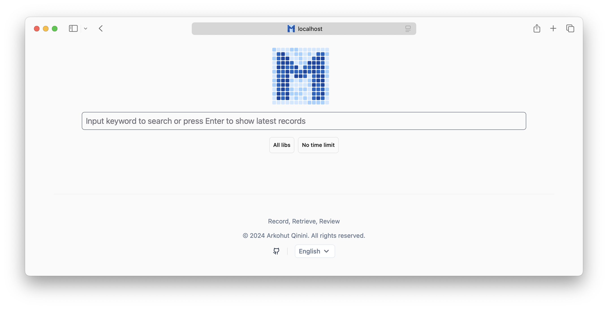

<!-- <div align="center">
  
</div> -->

[English](README.md) | [简体中文](README_ZH.md) | 日本語


[](https://www.bilibili.com/video/BV16XUkY7EJm)

> 名前をPensieveに変更しました。Memosという名前は既に使用されていたためです。

# Pensieve（以前の名前はMemos）

Pensieveはプライバシーに焦点を当てたパッシブレコーディングプロジェクトです。画面の内容を自動的に記録し、インテリジェントなインデックスを構築し、過去の記録を取得するための便利なWebインターフェースを提供します。

このプロジェクトは、他の2つのプロジェクト、[Rewind](https://www.rewind.ai/)と[Windows Recall](https://support.microsoft.com/en-us/windows/retrace-your-steps-with-recall-aa03f8a0-a78b-4b3e-b0a1-2eb8ac48701c)から多くのインスピレーションを得ています。しかし、これらとは異なり、Pensieveはデータの完全な制御を可能にし、信頼できないデータセンターへのデータ転送を避けることができます。

## 機能

- 🚀 簡単なインストール：pipを使用して依存関係をインストールするだけで開始できます
- 🔒 完全なデータ制御：すべてのデータはローカルに保存され、完全にローカルで操作でき、データ処理は自己管理できます
- 🔍 フルテキスト検索とベクトル検索のサポート
- 🤖 Ollamaと統合し、Pensieveの機械学習エンジンとして使用
- 🌐 任意のOpenAI APIモデル（OpenAI、Azure OpenAI、vLLMなど）に対応
- 💻 MacとWindowsをサポート（Linuxのサポートは開発中）
- 🔌 プラグインを通じて機能を拡張可能

## クイックスタート


> [!重要]  
> Pythonのsqlite3ライブラリのすべてのバージョンが`enable_load_extension`をサポートしているわけではないようです。しかし、どの環境やPythonのバージョンでこの問題が発生するかはわかりません。私はPythonを管理するために`conda`を使用しており、`conda`を介してインストールされたPythonはmacOS、Windows x86、およびUbuntu 22.04で正常に動作します。
>
> 次のコマンドがPython環境で動作することを確認してください：
>
> ```python
> import sqlite3
> print(sqlite3.sqlite_version)
> ```
>
> これが正しく動作しない場合は、Python環境を管理するために[miniconda](https://docs.conda.io/en/latest/miniconda.html)をインストールすることができます。あるいは、他の人が同じ問題に遭遇しているかどうかを確認するために、現在の問題リストをチェックしてください。

### 1. Pensieveのインストール

```sh
pip install memos
```

### 2. 初期化

pensieveの設定ファイルとsqliteデータベースを初期化します：

```sh
memos init
```

データは`~/.memos`ディレクトリに保存されます。

### 3. サービスの開始

```sh
memos enable
memos start
```

このコマンドは以下を行います：

- すべての画面の記録を開始
- Webサービスを開始
- サービスを起動時に開始するように設定

### 4. Webインターフェースへのアクセス

ブラウザを開き、`http://localhost:8839`にアクセスします



### Macの権限の問題

Macでは、Pensieveはスクリーンレコーディングの権限が必要です。プログラムが起動すると、Macはスクリーンレコーディングの権限を求めるプロンプトを表示します。許可してください。

## ユーザーガイド

### 適切な埋め込みモデルの使用

#### 1. モデルの選択

Pensieveは埋め込みモデルを使用してセマンティック情報を抽出し、ベクトルインデックスを構築します。したがって、適切な埋め込みモデルを選択することが重要です。ユーザーの主な言語に応じて、異なる埋め込みモデルを選択する必要があります。

- 中国語のシナリオでは、[jinaai/jina-embeddings-v2-base-zh](https://huggingface.co/jinaai/jina-embeddings-v2-base-zh)モデルを使用できます。
- 英語のシナリオでは、[jinaai/jina-embeddings-v2-base-en](https://huggingface.co/jinaai/jina-embeddings-v2-base-en)モデルを使用できます。

#### 2. Memos設定の調整

お好みのテキストエディタを使用して`~/.memos/config.yaml`ファイルを開き、`embedding`設定を変更します：

```yaml
embedding:
  use_local: true
  model: jinaai/jina-embeddings-v2-base-en   # 使用するモデル名
  num_dim: 768                               # モデルの次元数
  use_modelscope: false                      # ModelScopeのモデルを使用するかどうか
```

#### 3. Memosサービスの再起動

```sh
memos stop
memos start
```

埋め込みモデルを初めて使用する場合、Pensieveは自動的にモデルをダウンロードしてロードします。

#### 4. インデックスの再構築

使用中に埋め込みモデルを切り替えた場合、つまり以前にスクリーンショットをインデックス化していた場合、インデックスを再構築する必要があります：

```sh
memos reindex --force
```

`--force`パラメータは、インデックステーブルを再構築し、以前にインデックス化されたスクリーンショットデータを削除することを示します。

### Ollamaを使用したビジュアル検索

デフォルトでは、PensieveはOCRプラグインのみを有効にしてスクリーンショットからテキストを抽出し、インデックスを構築します。しかし、この方法ではテキストが含まれていない画像の検索効果が大幅に制限されます。

より包括的なビジュアル検索機能を実現するためには、OpenAI APIに対応したマルチモーダル画像理解サービスが必要です。Ollamaはこの役割を完璧に果たします。

#### 使用前の重要な注意事項

VLM機能を有効にする前に、以下の点に注意してください：

1. **ハードウェア要件**

   - 推奨構成：少なくとも8GBのVRAMを持つNVIDIAグラフィックスカードまたはMシリーズチップを搭載したMac
   - minicpm-vモデルは約5.5GBのストレージスペースを占有します
   - CPUモードの使用は推奨されません。システムの重大な遅延を引き起こします

2. **パフォーマンスと消費電力への影響**

   - VLMを有効にすると、システムの消費電力が大幅に増加します
   - 他のデバイスを使用してOpenAI APIに対応したモデルサービスを提供することを検討してください

#### 1. Ollamaのインストール

詳細なインストールと設定手順については、[Ollama公式ドキュメント](https://ollama.com)を参照してください。

#### 2. マルチモーダルモデルの準備

以下のコマンドを使用して、マルチモーダルモデル`minicpm-v`をダウンロードして実行します：

```sh
ollama run minicpm-v "このサービスが何であるかを説明してください"
```

このコマンドはminicpm-vモデルをダウンロードして実行します。実行速度が遅すぎる場合は、この機能の使用をお勧めしません。

#### 3. PensieveをOllamaで使用するように設定

お好みのテキストエディタを使用して`~/.memos/config.yaml`ファイルを開き、`vlm`設定を変更します：

```yaml
vlm:
  endpoint: http://localhost:11434  # Ollamaサービスのアドレス
  modelname: minicpm-v              # 使用するモデル名
  force_jpeg: true                  # 互換性を確保するために画像をJPEG形式に変換
  prompt: この画像の内容を説明してください。レイアウトや視覚要素を含めて  # モデルに送信されるプロンプト
```

上記の設定を使用して、`~/.memos/config.yaml`ファイルの`vlm`設定を上書きします。

また、`~/.memos/plugins/vlm/config.yaml`ファイルの`default_plugins`設定も変更します：

```yaml
default_plugins:
- builtin_ocr
- builtin_vlm
```

これにより、`builtin_vlm`プラグインがデフォルトのプラグインリストに追加されます。

#### 4. Pensieveサービスの再起動

```sh
memos stop
memos start
```

Pensieveサービスを再起動した後、しばらく待つと、PensieveのWebインターフェースで最新のスクリーンショットにVLMによって抽出されたデータが表示されます：


VLMの結果が表示されない場合は、以下を確認してください：

- `memos ps`コマンドを使用してPensieveプロセスが正常に実行されているか確認
- `~/.memos/logs/memos.log`にエラーメッセージがないか確認
- Ollamaモデルが正しくロードされているか確認（`ollama ps`）

### フルインデックス

Pensieveは計算集約型のアプリケーションです。インデックス作成プロセスには、OCR、VLM、および埋め込みモデルの協力が必要です。ユーザーのコンピュータへの影響を最小限に抑えるために、Pensieveは各スクリーンショットの平均処理時間を計算し、それに応じてインデックスの頻度を調整します。したがって、デフォルトではすべてのスクリーンショットがすぐにインデックス化されるわけではありません。

すべてのスクリーンショットをインデックス化したい場合は、以下のコマンドを使用してフルインデックスを実行できます：

```sh
memos scan
```

このコマンドは記録されたすべてのスクリーンショットをスキャンしてインデックス化します。スクリーンショットの数とシステム構成に応じて、このプロセスには時間がかかる場合があり、システムリソースを多く消費する可能性があります。インデックスの構築は冪等であり、このコマンドを複数回実行しても既にインデックス化されたデータを再インデックス化することはありません。

## プライバシーとセキュリティ

Pensieveの開発中、私は特に[Rewind](https://www.rewind.ai/)と[Windows Recall](https://support.microsoft.com/en-us/windows/retrace-your-steps-with-recall-aa03f8a0-a78b-4b3e-b0a1-2eb8ac48701c)の進展を密接に追っていました。これらの製品の理念には非常に感銘を受けましたが、プライバシー保護の面では十分ではありません。これは多くのユーザー（または潜在的なユーザー）が懸念している問題です。個人用コンピュータの画面を記録することは、銀行口座、パスワード、チャット記録など、非常に機密性の高いプライベートデータを露出させる可能性があります。したがって、データの保存と処理が完全にユーザーによって制御され、データの漏洩を防ぐことが特に重要です。

Pensieveの利点は次のとおりです：

1. コードは完全にオープンソースであり、理解しやすいPythonコードであり、誰でもコードをレビューしてバックドアがないことを確認できます。
2. データは完全にローカルに保存され、すべてのデータはローカルに保存され、データ処理は完全にユーザーによって制御されます。データはユーザーの`~/.memos`ディレクトリに保存されます。
3. 簡単にアンインストールできます。Pensieveを使用しなくなった場合、`memos stop && memos disable`でプログラムを閉じ、`pip uninstall memos`でアンインストールし、最後に`~/.memos`ディレクトリを削除してすべてのデータベースとスクリーンショットデータをクリーンアップできます。
4. データ処理は完全にユーザーによって制御されます。Pensieveは独立したプロジェクトであり、使用する機械学習モデル（VLMおよび埋め込みモデルを含む）はユーザーが選択します。Pensieveの運用モードにより、小さなモデルを使用しても良好な結果を得ることができます。

もちろん、プライバシーの面で改善の余地はまだあります。コードの貢献を歓迎し、Pensieveをより良くするために一緒に取り組みましょう。

## その他の注目すべき内容

### ストレージスペースについて

Pensieveは5秒ごとに画面を記録し、元のスクリーンショットを`~/.memos/screenshots`ディレクトリに保存します。ストレージスペースの使用量は主に次の要因に依存します：

1. **スクリーンショットデータ**：

   - 単一のスクリーンショットサイズ：約40〜400KB（画面解像度と表示の複雑さに依存）
   - 日次データ量：約400MB（10時間の使用時間、単一画面2560x1440解像度に基づく）
   - マルチスクリーンの使用：画面の数に応じてデータ量が増加
   - 月次推定：20営業日を基準に約8GB

   スクリーンショットは重複排除されます。連続するスクリーンショットの内容があまり変わらない場合、1つのスクリーンショットのみが保持されます。重複排除メカニズムは、内容が頻繁に変わらないシナリオ（読書、文書編集など）でストレージ使用量を大幅に削減できます。

2. **データベーススペース**：

   - SQLiteデータベースのサイズはインデックス化されたスクリーンショットの数に依存します
   - 参考値：10万枚のスクリーンショットをインデックス化した後、約2.2GBのストレージスペースを占有

### 消費電力について

Pensieveはデフォルトで2つの計算集約型タスクを必要とします：

- 1つはOCRタスクで、スクリーンショットからテキストを抽出するために使用されます
- もう1つは埋め込みタスクで、セマンティック情報を抽出してベクトルインデックスを構築するために使用されます

#### リソース使用状況

- **OCRタスク**：CPUを使用して実行され、異なるオペレーティングシステムに基づいてOCRエンジンを最適化して選択し、CPUの使用を最小限に抑えます
- **埋め込みタスク**：計算デバイスをインテリジェントに選択

  - NVIDIA GPUデバイスはGPUを優先的に使用
  - MacデバイスはMetal GPUを優先的に使用
  - その他のデバイスはCPUを使用

#### パフォーマンス最適化戦略

ユーザーの日常使用に影響を与えないようにするために、Pensieveは次の最適化措置を講じています：

- インデックスの頻度を動的に調整し、システムの処理速度に適応
- バッテリー駆動時に処理頻度を自動的に低下させ、電力を最大限に節約

## 開発ガイド

### 最初のレイヤーを剥がす

実際、Pensieveが起動すると、3つのプログラムが実行されます：

1. `memos serve`はWebサービスを開始
2. `memos record`はスクリーンショット記録プログラムを開始
3. `memos watch`は`memos record`によって生成された画像イベントをリッスンし、実際の処理速度に基づいてサーバーにインデックスリクエストを動的に送信

したがって、開発者である場合、またはプロジェクト全体の実行ログをより明確に表示したい場合は、これらの3つのコマンドを使用して各部分を前景で実行し、`memos enable && memos start`コマンドの代わりに使用できます。
