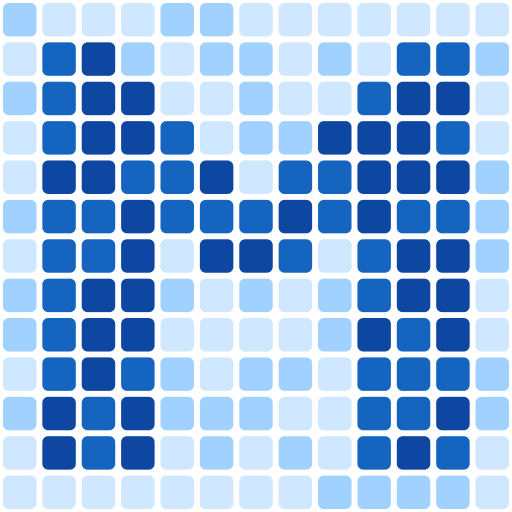
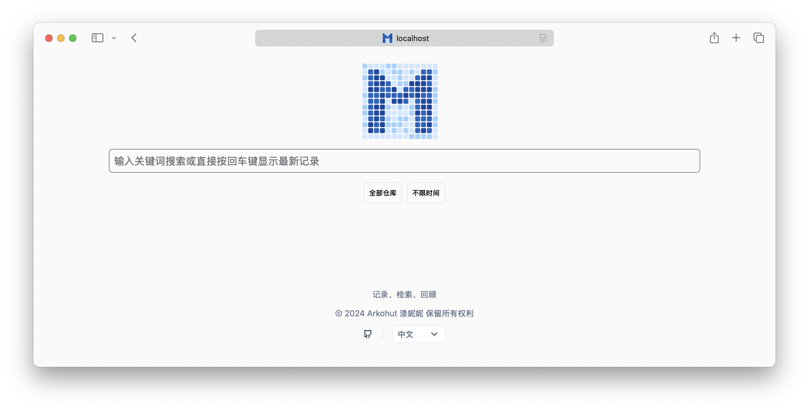
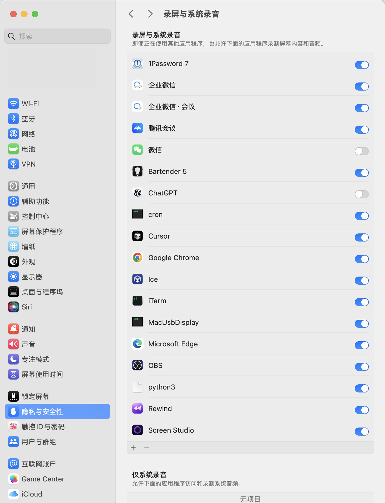
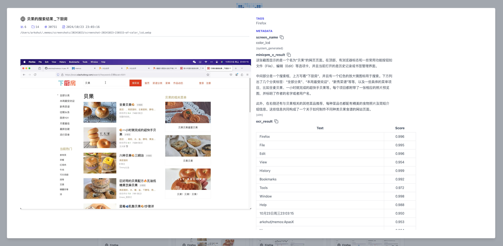

<!-- <div align="center">
  
</div> -->

[English](README.md) | 简体中文


> 我对名字进行了调整，因为 Memos 这个名字已经被其他人注册了，所以改成了 Pensieve。

# Pensieve（原 Memos）

Pensieve 是一个专注于隐私的被动记录项目。它可以自动记录屏幕内容，构建智能索引，并提供便捷的 web 界面来检索历史记录。

这个项目主要参考了另外两个项目，一个叫做 [Rewind](https://www.rewind.ai/)，另一个叫做 [Windows Recall](https://support.microsoft.com/en-us/windows/retrace-your-steps-with-recall-aa03f8a0-a78b-4b3e-b0a1-2eb8ac48701c)。不过，与它们不同的是 Pensieve 让你可以完全管控自己的数据，避免将数据传递到不信任的数据中心。

## 功能特性

- 🚀 安装简单，只需要通过 pip 安装依赖就可以开始使用了
- 🔒 数据全掌控，所有数据都存储在本地，可以完全本地化运行，数据处理完全由自己控制
- 🔍 支持全文检索和向量检索
- 🤖 支持和 Ollama 一起工作，让 Ollama 作为 Pensieve 的机器学习引擎
- 🌐 支持任何 OpenAI API 兼容的模型（比如 OpenAI, Azure OpenAI，vLLM 等）
- 💻 支持 Mac 和 Windows 系统（Linux 支持正在开发中）
- 🔌 支持通过插件扩展出更多数据处理能力

## 快速开始


### 1. 安装 Pensieve

```sh
pip install -i https://mirrors.tuna.tsinghua.edu.cn/pypi/web/simple memos
```

### 2. 初始化

初始化 pensieve 的配置文件和 sqlite 数据库：

```sh
memos init
```

数据将存放在 `~/.memos` 目录中。

### 3. 启动服务

```sh
memos enable
memos start
```

这个命令会：

- 开始对所有屏幕进行记录
- 启动 Web 服务
- 将服务设置为开机启动

### 4. 访问 Web 界面

打开浏览器，访问 `http://localhost:8839`



### Mac 下的权限问题

在 Mac 下，Pensieve 需要获取截图权限，程序启动的时候，Mac 就会提示需要录屏的权限，请允许即可。



## 使用指南

### 使用合适的 embedding 模型

#### 1. 模型选择

Pensieve 通过 embedding 模型来提取语义信息，并构建向量索引。因此，选择一个合适的 embedding 模型非常重要。针对使用者的主语言，需要选择不同的 embedding 模型。

- 对于中文场景，可以使用 [jinaai/jina-embeddings-v2-base-zh](https://huggingface.co/jinaai/jina-embeddings-v2-base-zh) 模型。
- 对于英文场景，可以使用 [jinaai/jina-embeddings-v2-base-en](https://huggingface.co/jinaai/jina-embeddings-v2-base-en) 模型。

#### 2. 调整 Pensieve 配置

使用你喜欢的文本编辑器打开 `~/.memos/config.yaml` 文件，并修改 `embedding` 配置：

```yaml
embedding:
  use_local: true
  model: arkohut/jina-embeddings-v2-base-zh  # 使用的模型名称
  num_dim: 768                               # 模型的维度             
  use_modelscope: false                      # 是否使用魔搭（ModelScope）的模型
```

- 配置这里我使用的模型名称为 `arkohut/jina-embeddings-v2-base-zh`，这是我对原始的模型仓库做了裁剪，删除了一些用不到的模型文件，加速下载的速度。
- 如果你无法访问 Hugging Face 的模型仓库，可以设置 `use_modelscope` 为 `true`，通过魔搭（ModelScope）模型仓库下载模型。

#### 3. 重启 Pensieve 服务

```sh
memos stop
memos start
```

第一次使用 embedding 模型时，Pensieve 会自动下载模型并加载模型。

#### 4. 重新构建索引

如果你是在使用过程中切换了 embedding 模型，也就是说你之前已经索引过截图，那么你需要重新构建索引：

```sh
memos reindex --force
```

`--force` 参数表示重新构建索引表，并删除之前索引的截图数据。

### 使用 Ollama 支持视觉检索

默认情况下，Pensieve 仅启用 OCR 插件来提取截图中的文字并建立索引。然而，对于不包含文字的图像，这种方式会大大限制检索效果。

为了实现更全面的视觉检索功能，我们需要一个兼容 OpenAI API 的多模态图像理解服务。Ollama 正好可以完美胜任这项工作。

#### 使用前的重要说明

在决定是否启用 VLM 功能前，请注意以下几点：

1. **硬件要求**

   - 推荐配置：至少 8GB 显存的 NVIDIA 显卡或 M 系列芯片的 Mac
   - minicpm-v 模型将占用约 5.5GB 存储空间
   - 不建议使用 CPU 模式，会导致系统严重卡顿

2. **性能和功耗影响**

   - 启用 VLM 后会显著增加系统功耗
   - 可以考虑使用其他设备提供 OpenAI API 兼容的模型服务

#### 1. 安装 Ollama

请访问 [Ollama 官方文档](https://ollama.com) 获取详细的安装和配置指南。

#### 2. 准备多模态模型

使用以下命令下载并运行多模态模型 `minicpm-v`：

```sh
ollama run minicpm-v "描述一下这是什么服务"
```

这条命令会下载并运行 minicpm-v 模型，如果发现运行速度太慢的话，不推荐使用这部分功能。

#### 3. 配置 Pensieve 使用 Ollama

使用你喜欢的文本编辑器打开 `~/.memos/config.yaml` 文件，并修改 `vlm` 配置：

```yaml
vlm:
  endpoint: http://localhost:11434  # Ollama 服务地址
  modelname: minicpm-v              # 使用的模型名称
  force_jpeg: true                  # 将图片转换为 JPEG 格式以确保兼容性
  prompt: 请帮描述这个图片中的内容，包括画面格局、出现的视觉元素等  # 发送给模型的提示词
```

使用上述配置覆盖 `~/.memos/config.yaml` 文件中的 `vlm` 配置。

同时还要修改 `~/.memos/plugins/vlm/config.yaml` 文件中的 `default_plugins` 配置：

```yaml
default_plugins:
- builtin_ocr
- builtin_vlm
```

这里就是将 `builtin_vlm` 插件添加到默认的插件列表中。

#### 4. 重启 Pensieve 服务

```sh
memos stop
memos start
```

重启 Pensieve 服务之后，稍等片刻，就可以在 Pensieve 的 Web 界面中最新的截图里看到通过 VLM 所提取的数据了：



如果没有看到 VLM 的结果，可以：

- 使用命令 `memos ps` 查看 Pensieve 进程是否正常运行
- 检查 `~/.memos/logs/memos.log` 中是否有错误信息
- 确认 Ollama 模型是否正确加载（`ollama ps`）

### 全量索引

Pensieve 是一个计算密集型的应用，Pensieve 的索引过程会需要 OCR、VLM 以及 embedding 模型协同工作。为了尽量减少对用户电脑的影响，Pensieve 会计算每个截图的平均处理时间，并依据这个时间来调整索引的频率。因此，默认情况下并不是所有的截图都会被立即索引。

如果希望对所有截图进行索引，可以使用以下命令进行全量索引：

```sh
memos scan
```

该命令会扫描并索引所有已记录的截图。请注意，根据截图数量和系统配置的不同，这个过程可能会持续一段时间，并且会占用较多系统资源。索引的构建是幂等的，多次运行该命令不会对已索引的数据进行重复索引。

## 隐私安全

在开发 Pensieve 的过程中，我一直密切关注类似产品的进展，特别是 [Rewind](https://www.rewind.ai/) 和 [Windows Recall](https://support.microsoft.com/en-us/windows/retrace-your-steps-with-recall-aa03f8a0-a78b-4b3e-b0a1-2eb8ac48701c)。我非常欣赏它们的产品理念，但它们在隐私保护方面做得不够，这也是许多用户（或潜在用户）所担心的问题。记录个人电脑的屏幕可能会暴露极为敏感的隐私数据，如银行账户、密码、聊天记录等。因此，确保数据的存储和处理完全由用户掌控，防止数据泄露，变得尤为重要。

Pensieve 的优势在于：

1. 代码完全开源，并且是易于理解的 Python 代码，任何人都可以审查代码，确保没有后门。
2. 数据完全本地化，所有数据都存储在本地，数据处理完全由用户控制，数据将被存储在用户的 `~/.memos` 目录中。
3. 易于卸载，如果不再使用 Pensieve，通过 `memos stop && memos disable` 即可关闭程序，然后通过 `pip uninstall memos` 即可卸载，最后删除 `~/.memos` 目录即可清理所有的数据库和截图数据。
4. 数据处理完全由用户控制，Pensieve 是一个独立项目，所使用的机器学习模型（包括 VLM 以及 embedding 模型）都由用户自己选择，并且由于 Pensieve 的运作模式，使用较小的模型也可以达到不错的效果。

当然 Pensieve 肯定在隐私方面依然有可以改进的地方，欢迎大家贡献代码，一起让 Pensieve 变得更好。

## 其他值得注意的内容

### 有关存储空间

Pensieve 每 5 秒会记录一次屏幕，并将原始截图保存到 `~/.memos/screenshots` 目录中。存储空间占用主要取决于以下因素：

1. **截图数据**：

   - 单张截图大小：约 40-400KB（取决于屏幕分辨率以及显示的复杂程度）
   - 日均数据量：约 400MB（基于 10 小时使用时长，单屏幕 2560x1440 分辨率）
   - 多屏幕使用：数据量会随屏幕数量增加
   - 月度估算：按 20 个工作日计算，约 8GB

   截图会进行去重，如果连续截图内容变化不大，那么只会保留一张截图，去重机制可以在内容变化不频繁时（如阅读、文档编辑等场景）显著减少存储占用。

2. **数据库空间**：

   - SQLite 数据库大小取决于索引的截图数量
   - 参考值：10 万张截图索引后约占用 2.2GB 存储空间

### 有关功耗

Pensieve 默认需要两个计算密集型的任务：

- 一个是 OCR 任务，用于提取截图中的文字
- 一个是 embedding 任务，用于提取语义信息构建向量索引

#### 资源使用情况

- **OCR 任务**：使用 CPU 执行，并根据不同操作系统优化选择 OCR 引擎，以最小化 CPU 占用
- **Embedding 任务**：智能选择计算设备

  - NVIDIA GPU 设备优先使用 GPU
  - Mac 设备优先使用 Metal GPU
  - 其他设备使用 CPU

#### 性能优化策略

为了避免影响用户日常使用，Pensieve 采取了以下优化措施：

- 动态调整索引频率，根据系统处理速度自适应
- 电池供电时自动降低处理频率，最大程度节省电量

## 开发指南

### 拨开第一层洋葱

事实上，Pensieve 启动之后，会运行三个程序：

1. `memos serve` 启动 Web 服务
2. `memos record` 启动截图记录程序
3. `memos watch` 监听 `memos record` 所生成的图像事件，并结合实际的处理速度动态的向服务器提交索引请求

所以，如果你是开发者，或者希望更清晰的看到整个项目运行的日志，你完全可以使用这三个命令让每个部分在前台运行，去替代 `memos enable && memos start` 命令。
